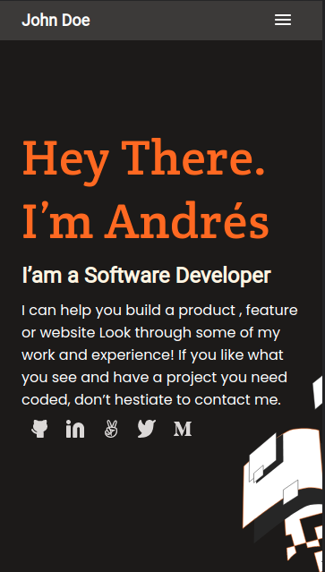

# Portfolio

> This is the first Microverse project prepared for module one, where we look at the basics of how to write proper HTML/CSS while building a project. 

This is a Portfolio that works as a presentation card for a Software developer, showcasing some important projects, personal and contact info, while keeping a fresh and elegant web design. 

## Built With

- HTML/CSS
- Visual Studio Code, Chrome Developer Tools

## Authors

👤 **Author1**

- GitHub: [@JohnFTitor](https://github.com/JohnFTitor)
- Twitter: [@johnftitor](https://twitter.com/johnftitor)
- LinkedIn: [Andres](https://www.linkedin.com/in/andresfelipe117/?locale=en_US)

## Show your support

Give a ⭐️ if you like this project!

## 📝 License

This project is [MIT](./MIT.md) licensed.
